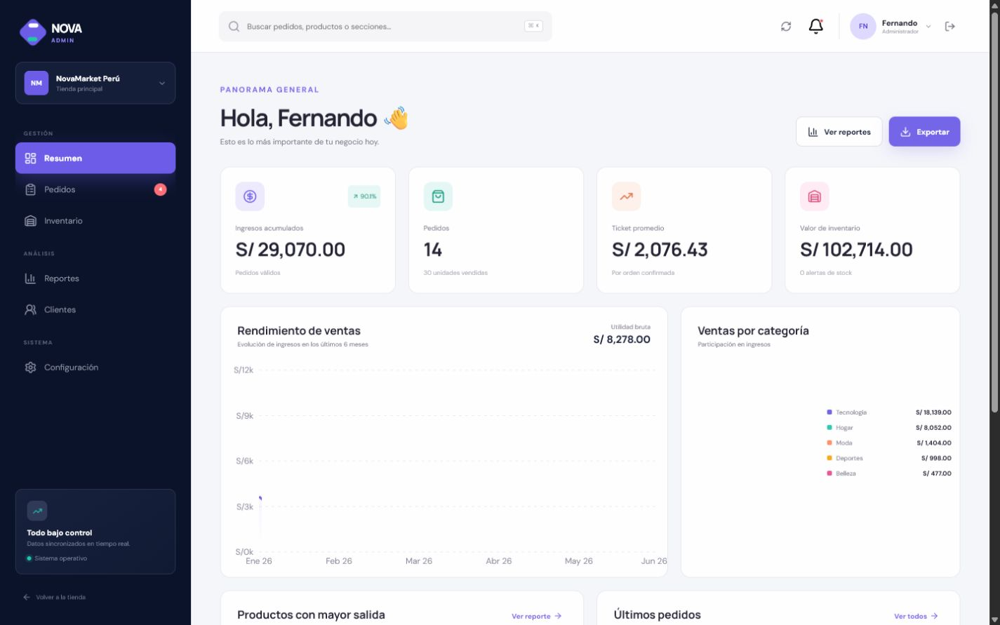
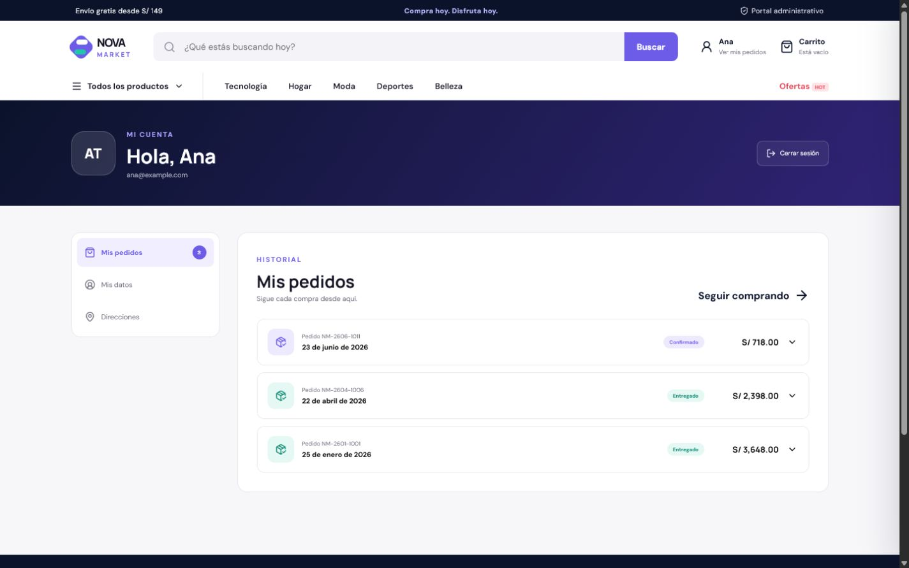
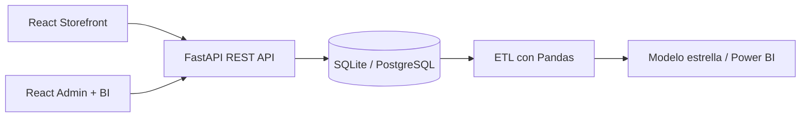

# NovaMarket

Plataforma e-commerce full stack de una tienda por departamentos ficticia, con gestión de inventario y Business Intelligence. Fue diseñada como proyecto de portafolio para demostrar desarrollo frontend, backend, modelado de datos y análisis.






## Qué incluye

- Catálogo con búsqueda, categorías, filtros y ordenamiento.
- Fichas de producto, ofertas, stock y productos relacionados.
- Carrito persistente y checkout con validaciones.
- Creación transaccional de pedidos y descuento automático de inventario.
- Panel administrativo protegido con JWT.
- Registro e inicio de sesión de clientes con perfil, dirección e historial de pedidos.
- Gestión de pedidos y ajustes de inventario auditables.
- Alta de productos, filtros, detalle de pedidos, clientes y configuración persistente.
- Dashboard BI: ingresos, utilidad, ticket promedio, ventas mensuales, categorías, productos y alertas.
- Exportación CSV y ETL para construir un modelo estrella en Power BI.
- Compatibilidad con SQLite para la demo y PostgreSQL para producción.
- API documentada automáticamente con OpenAPI/Swagger.

## Stack

| Capa | Tecnología |
|---|---|
| Frontend | React, Vite, React Router, Recharts, Lucide |
| Backend | FastAPI, SQLAlchemy, Pydantic, JWT |
| Base de datos | SQLite / PostgreSQL |
| BI | Pandas, modelo estrella, DAX, dashboard web |
| Infraestructura | Docker Compose, scripts PowerShell |

## Arquitectura



## Ejecución rápida en Windows

Después de completar la instalación inicial, también puedes abrir `Iniciar NovaMarket.vbs` con doble clic. El iniciador levanta la API y el frontend en segundo plano y abre la tienda automáticamente.

### Instalación inicial

Abre PowerShell dentro de esta carpeta:

```powershell
powershell -ExecutionPolicy Bypass -File .\scripts\setup.ps1
powershell -ExecutionPolicy Bypass -File .\scripts\start.ps1
```

Luego visita:

- Tienda: http://127.0.0.1:5173
- Panel administrativo: http://127.0.0.1:5173/admin
- Documentación API: http://127.0.0.1:8000/docs

### Credenciales de demostración

```text
Administrador
Correo: admin@novamarket.pe
Contraseña: Nova2026!

Cliente
Correo: ana@example.com
Contraseña: Cliente2026!
```

La pasarela de pago es simulada: no se procesan cobros reales.

## Pruebas

```powershell
cd backend
.\.venv\Scripts\python.exe -m pytest -q
```

## ETL para Power BI

Con la base creada, ejecuta:

```powershell
cd backend
.\.venv\Scripts\python.exe ..\analytics\etl.py
```

Se generan `fact_sales`, `dim_product`, `dim_customer`, `dim_date` e `inventory_snapshot`. Las medidas sugeridas están en `analytics/measures.dax`.

## PostgreSQL y Docker

Cuando Docker esté instalado:

```powershell
docker compose up --build
```

La variable `DATABASE_URL` permite utilizar una instancia PostgreSQL externa. Consulta `backend/.env.example` y `database/schema-postgresql.sql`.

## Estructura

```text
full stack/
├── frontend/          # Tienda y panel administrativo React
├── backend/           # API, dominio, autenticación y persistencia
├── database/          # Índices y vistas PostgreSQL
├── analytics/         # ETL, modelo estrella y medidas DAX
├── scripts/           # Instalación y arranque en Windows
├── docker-compose.yml
└── README.md
```

> NovaMarket es una marca ficticia creada exclusivamente como demostración técnica.
